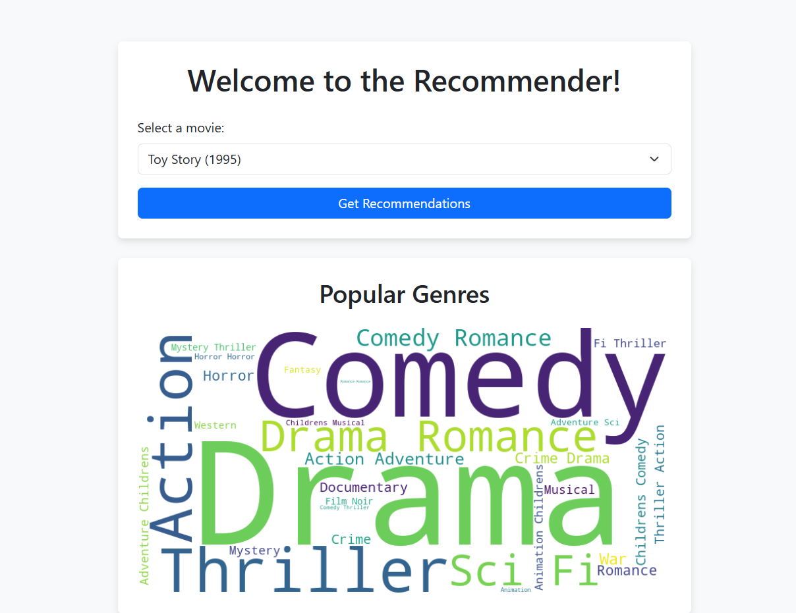
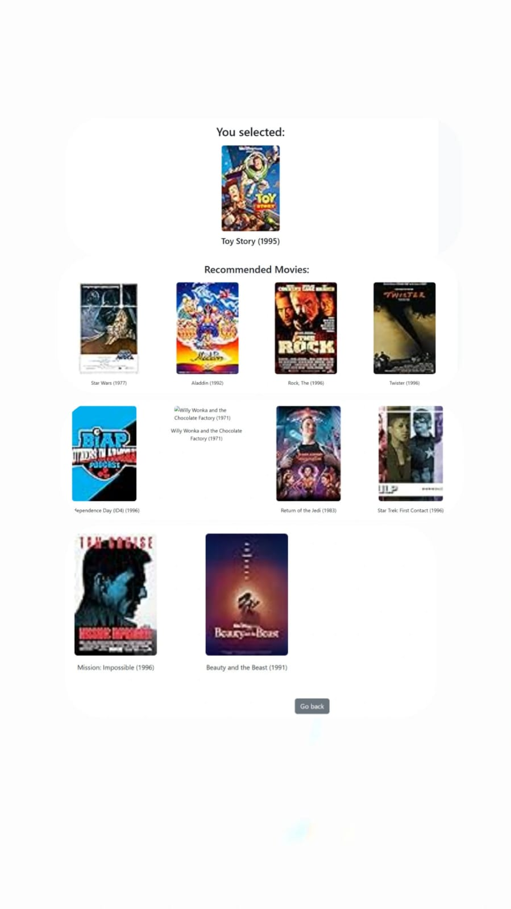

# Movie Recommendation System 🎬

A personalized movie recommendation engine built with Python and Django. This system uses item-item similarity to suggest movies.

## 📸 Screenshots
### Main Interface

### Recommendation Results

## 🛠️ Tech Stack
* **Backend**: Django (Python)
* **Data**: Pandas, NumPy
* **API**: Cinemagoer (IMDb)

## 🚀 Features
* **Recommendation Engine**: Uses item-item similarity matrices to find related movies.
* **Dynamic Posters**: Integrates with IMDb data to display movie covers.
* **Interactive UI**: Clean web interface for searching and viewing recommendations.

  ## 📁 Project Structure
* **movie_recommender/**: The main Django application containing views, models, and recommendation logic.
* **landing_page.png**: A screenshot of the home page and genre word cloud.
* **recommendations.jpeg**: A screenshot showing the recommendation results with posters.
* **requirements.txt**: A list of all Python libraries needed to run this project.
* **README.md**: This documentation file you are reading right now.
